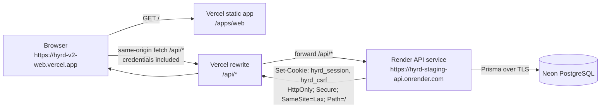

# HYRD Deployment Architecture

Checked on: 2026-09-05

## 1. Executive summary

HYRD is ready for a private staging deployment with one important topology constraint: cookie authentication should not rely on the browser accepting third-party cookies between unrelated provider domains.

The recommended staging architecture is:

- Web: Vercel static Vite deployment at `https://hyrd-v2-web.vercel.app`.
- API: Render Node.js Web Service at `https://hyrd-staging-api.onrender.com`.
- Database: Neon PostgreSQL.
- Browser request flow: the frontend calls its own origin at `/api/*`; Vercel rewrites those requests to the Render API.

This keeps the session and CSRF cookies first-party to the web origin, avoids cross-site cookie fragility, keeps costs low, and preserves a clean path to future custom domains.

## 2. Repository deployment requirements

HYRD is an npm monorepo with workspaces under `apps/*` and `packages/*`. The root requires Node.js `>=22`.

Frontend:

- Workspace: `apps/web`
- Framework: React, Vite, TypeScript, Tailwind, React Router, TanStack Query
- Build script: `npm run build --workspace=web`
- Test script: `npm run test --workspace=web`
- Lint script: `npm run lint --workspace=web`
- Output directory: `apps/web/dist`
- Public API setting: `VITE_API_URL`
- SPA routing: browser deep links must serve `index.html`.

API:

- Workspace: `apps/api`
- Runtime: Express 5, TypeScript, Prisma, PostgreSQL
- Build script: `npm run build --workspace=@hyrd/api`
- Start script: `npm run start --workspace=@hyrd/api`
- Typecheck script: `npm run typecheck --workspace=@hyrd/api`
- Test script: `npm run test --workspace=@hyrd/api`
- Prisma Client generation: `npm run prisma:generate --workspace=@hyrd/api`
- Migration command for deployment: `npm exec --workspace=@hyrd/api -- prisma migrate deploy`
- Health endpoint: `GET /api/health`
- Readiness endpoint: `GET /api/ready`

Local PostgreSQL is provided by `compose.yaml` using `postgres:17-alpine`.

## 3. Provider comparison

### Frontend providers

| Provider | Free or trial status | Relevant limits | Fit for HYRD staging |
| --- | --- | --- | --- |
| Vercel | Hobby plan is free for personal projects. | Hobby includes usage caps, 100 GB/month fast data transfer, 1M edge requests/month, 45-minute build-time limit, and 1 concurrent build. Vite SPA deep-linking needs a rewrite to `index.html`. External-origin rewrites can proxy `/api/*`. | Best fit for staging because Vite support and external rewrites are straightforward. |
| Cloudflare Pages | Free plan exists. | Free plan includes 500 builds/month, 1 concurrent build, 20-minute build timeout, 20,000 files, 25 MiB max file size, and many custom domains. Pages redirects support SPA fallback, but advanced rewrite support is more limited than Vercel/Netlify for this use case. | Strong static host, but less direct for an external API proxy without adding Workers complexity. |
| Netlify | Free plan exists with 300 credits/month. | Free deploy previews, custom domains with SSL, CDN, and rewrite/proxy support. Proxy rewrite timeout is 26 seconds. | Viable fallback for static hosting plus `/api` proxy. |

### API providers

| Provider | Free or trial status | Relevant limits | Fit for HYRD staging |
| --- | --- | --- | --- |
| Render | Free web services exist. | Free services sleep after 15 minutes idle and take about one minute to spin up. Render provides managed TLS, custom domains, logs, service previews, and limited rollbacks. Default web-service port is `10000`, exposed through `PORT`. | Best low-friction Express host for staging. Cold starts are the main limitation. |
| Railway | One-time $5 trial credit for new users; Hobby includes $5/month usage with paid subscription. | Usage-based billing after credits. Good monorepo and database ergonomics, but less predictably free than Render for an always-available staging API. | Good developer experience, but not the lowest-risk free staging choice. |
| Fly.io | Free trial is short: 2 total VM hours or 7 days. | Trial machines auto-stop after 5 minutes of runtime. Managed or self-managed Postgres can add operational complexity and cost. | Powerful, but too infrastructure-heavy for the first private staging target. |
| Koyeb | Free web service exists. | One free web service per organization with 512 MB RAM, 0.1 vCPU, 2 GB SSD; free instances scale to zero after one hour idle. | Viable fallback. Free tier is constrained but understandable. |

### PostgreSQL providers

| Provider | Free or trial status | Relevant limits | Fit for HYRD staging |
| --- | --- | --- | --- |
| Neon | Free plan exists with no credit card. | Free plan includes limited storage and compute; compute idles after inactivity and wakes on demand. Prisma recommends pooled Neon connection strings for runtime and direct connection strings for migrations in newer Prisma setups. | Best staging fit: no 30-day database expiry, PostgreSQL-native, and easy to replace later. |
| Supabase | Free plan exists. | Free plan includes 500 MB database, 5 GB egress, 2 active projects, and pauses after one week inactivity. SSL enforcement is configurable; pooler/direct connection choices matter. | Good fallback, but includes more platform surface area than HYRD needs right now. |
| Render PostgreSQL | Free PostgreSQL exists. | Free database is limited to 1 GB and expires after 30 days, with a grace period before deletion. Internal URLs work well with Render services. | Useful for short demos, but expiration makes it a poor private staging database. |
| Koyeb PostgreSQL | Free database exists. | Free database has active-time and storage limitations. | Possible, but Neon is simpler and more mature for this exact staging need. |

## 4. Cookie and domain topology analysis

### Origin versus site

An origin is scheme, host, and port together, such as `https://hyrd-staging.vercel.app`. A site is based on the registrable domain, such as `example.com`, and includes its subdomains. `https://app.example.com` and `https://api.example.com` are different origins but same-site. `https://project.vercel.app` and `https://project.onrender.com` are different origins and different sites.

### Option 1: separate provider domains

Example:

- Web: `https://hyrd-staging.vercel.app`
- API: `https://hyrd-api.onrender.com`

This is cross-origin and cross-site. HYRD can technically send credentialed requests because the frontend uses `credentials: "include"` and the API uses CORS with one explicit `CLIENT_ORIGIN`. However, the API's host-only cookies belong to `hyrd-api.onrender.com`, while the top-level page is `hyrd-staging.vercel.app`.

For `fetch` calls from the frontend, that makes the session and CSRF cookies third-party cookies. `SameSite=None; Secure` is required, but it is not sufficient in every browser because third-party-cookie restrictions can block or partition those cookies. Safari's WebKit documentation says full third-party cookie blocking is enabled, and MDN documents that `SameSite=None` requires `Secure` but still operates in the third-party-cookie model.

Conclusion: usable for quick experiments in some browsers, but not reliable enough for HYRD staging authentication.

### Option 2: custom same-site subdomains

Example:

- Web: `https://app.example.com`
- API: `https://api.example.com`

This is cross-origin but same-site. With `COOKIE_SAME_SITE=lax` or `strict`, cookies can avoid the third-party-cookie problem because both hosts share the same registrable domain. HYRD's current host-only cookies would be scoped to `api.example.com`; they would still be sent on same-site requests to the API host. CORS still needs `CLIENT_ORIGIN=https://app.example.com`, and the frontend still needs `credentials: "include"`.

Conclusion: strong eventual-production shape. It requires a custom domain and DNS/TLS setup, so it is more work than the first private staging deployment.

### Option 3: same-origin API proxy

Example:

- Browser loads `https://hyrd-v2-web.vercel.app`
- Browser calls `https://hyrd-v2-web.vercel.app/api/*`
- Vercel rewrites `/api/*` to `https://hyrd-staging-api.onrender.com/api/*`

The browser sees same-origin requests, so HYRD's host-only cookies are first-party to the frontend origin. This avoids third-party-cookie blocking and keeps the frontend code simple if `VITE_API_URL` is set to the frontend origin. The API should still set `CLIENT_ORIGIN` to the frontend origin because the forwarded unsafe requests can include the browser's `Origin` header.

For production-like staging on provider domains, this is the safest simple option.

### Option 4: one service serving frontend and API

The Express API could eventually serve the built Vite assets and route non-API paths to `index.html`, creating one true origin. The current repository does not implement static frontend serving in the API and has no Dockerfile or deploy configuration for a combined service.

Conclusion: technically compatible, but it requires application/deployment changes that are outside this planning task. It may also give up the static-host CDN benefits.

### Recommended topology conclusion

For private staging, use a same-origin `/api` proxy. For public production, prefer custom same-site subdomains or the same-origin proxy behind a custom domain.

## 5. Recommended staging architecture

- Web service: Vercel static deployment from `apps/web`.
- API service: Render Node.js Web Service from `apps/api`.
- PostgreSQL: Neon free PostgreSQL.
- Staging web URL: `https://hyrd-v2-web.vercel.app`.
- Staging API URL: `https://hyrd-staging-api.onrender.com`.
- Domain strategy: use the Vercel staging URL as the browser origin and proxy `/api/*` to Render.
- API direct URL: keep available for health/readiness checks and provider routing, but do not use it as `VITE_API_URL` in the browser.
- Cookies: host-only, `HttpOnly`, `Secure`, `SameSite=Lax` when same-origin proxying works; use `SameSite=None` only for truly cross-site frontend/API topology.
- Rate limiting: current in-memory limiter is acceptable for one staging API instance.

Why selected:

- Avoids third-party-cookie risk without requiring a purchased domain.
- Uses low-cost/free-friendly providers.
- Keeps the mental model simple for a junior developer.
- Preserves migration path to custom production domains.
- Requires only deployment configuration in Sprint 10 Part 2.

## 6. Fallback architecture

Use Netlify static hosting with a proxy rewrite from `/api/*` to Render, plus Neon PostgreSQL. Netlify's proxy support is documented and works for SPAs, but its 26-second proxy timeout and credit model make Vercel a slightly cleaner first recommendation.

If Render cold starts become too painful, Koyeb can replace Render for the API. It also scales to zero on the free tier, so this is a lateral fallback rather than a full cold-start solution.

## 7. Eventual production architecture

Preferred public-production topology:

- `https://app.example.com` for the frontend.
- `https://api.example.com` for the API.
- Managed PostgreSQL on a paid Neon, Supabase, Render, or similar tier with backups.
- `CLIENT_ORIGIN=https://app.example.com`
- `VITE_API_URL=https://api.example.com`
- `COOKIE_SAME_SITE=lax`
- `TRUST_PROXY=1` or the provider-recommended equivalent.

This keeps authentication same-site, avoids third-party-cookie reliance, and separates static delivery from the API. A same-origin custom-domain proxy such as `https://staging.example.com/api/*` is also acceptable if operational simplicity matters more than subdomain separation.

## 8. Request-flow diagram



## 9. Environment-variable matrix

| Variable | App | Required | Classification | Staging value shape | Behavior |
| --- | --- | --- | --- | --- | --- |
| `VITE_API_URL` | Web | Yes | Public build-time value | `https://hyrd-v2-web.vercel.app` when proxying | Base URL used by the browser API client. It is included in the frontend bundle. |
| `DATABASE_URL` | API | Yes | Secret | Neon PostgreSQL URL with TLS, such as pooled runtime URL if compatible | Used by Prisma adapter and migrations. Never expose to the browser. |
| `NODE_ENV` | API | Yes | Staging-specific config | `production` | Enables production cookie security and disables Swagger by default. |
| `PORT` | API | Provider assigned | Provider/runtime config | Render default or provided value, commonly `10000` | Express listens on this port. |
| `CLIENT_ORIGIN` | API | Yes | Staging-specific config | `https://hyrd-v2-web.vercel.app` | CORS allowlist and unsafe-request Origin validation. |
| `LOG_LEVEL` | API | No | Staging-specific config | `info` | Controls pino logging level. |
| `TRUST_PROXY` | API | Yes for Render | Staging-specific config | `1` | Lets Express trust the provider proxy for IP/protocol-aware behavior. |
| `COOKIE_SAME_SITE` | API | No | Staging-specific config | `lax` for same-origin proxy; `none` for cross-site domains | Defaults to `none` in production if omitted. |
| `CSRF_SECRET` | API | Yes in production | Secret | 32+ character random value | Signs CSRF tokens and session bindings. |
| `GENERAL_RATE_LIMIT_MAX` | API | No | Staging-specific config | `300` or lower for staging | General 15-minute IP limit. |
| `AUTH_RATE_LIMIT_MAX` | API | No | Staging-specific config | `20` or lower for staging | Login/register 15-minute IP limit. |
| `ENABLE_API_DOCS` | API | No | Staging-specific config | `false` or omitted with `NODE_ENV=production` | `/api/docs` and `/api/docs.json` disabled by default in production. |

## 10. Build and deployment commands

Install from repository root:

```sh
npm ci
```

Web:

```sh
npm run build --workspace=web
```

Working directory:

```text
apps/web
```

Output directory:

```text
apps/web/dist
```

API:

```sh
npm run build --workspace=@hyrd/api
npm run start --workspace=@hyrd/api
```

Working directory:

```text
apps/api
```

Prisma Client generation:

```sh
npm run prisma:generate --workspace=@hyrd/api
```

Deployment migration:

```sh
npm exec --workspace=@hyrd/api -- prisma migrate deploy
```

Health check:

```text
/api/health
```

Readiness check:

```text
/api/ready
```

SPA fallback:

- Vercel should use `apps/web/vercel.json` because the Vercel project Root Directory is `apps/web`.
- Vercel should rewrite non-API paths to `index.html`.
- `/api/*` must be evaluated before the SPA fallback.

Current Vercel rewrite configuration:

```json
{
  "$schema": "https://openapi.vercel.sh/vercel.json",
  "rewrites": [
    {
      "source": "/api/:path*",
      "destination": "https://hyrd-staging-api.onrender.com/api/:path*"
    },
    {
      "source": "/(.*)",
      "destination": "/index.html"
    }
  ]
}
```

Deployment order:

1. Create PostgreSQL database.
2. Configure API environment variables.
3. Deploy API.
4. Run `prisma migrate deploy` once.
5. Verify `/api/health` and `/api/ready`.
6. Configure frontend `VITE_API_URL`.
7. Configure frontend `/api/*` proxy and SPA fallback.
8. Deploy frontend.
9. Run the staging smoke-test checklist.

## 11. Migration strategy

Run migrations with `prisma migrate deploy`, not `prisma migrate dev`.

Avoid concurrent migrations:

- Run migrations as a single explicit deployment step.
- Do not run migrations in both API start command and a separate release command.
- If using provider deploy hooks, ensure only one API deployment for the target branch can run migrations at a time.

Rollback limitation:

- Application rollbacks can restore an older API/web deploy.
- Prisma migrations are normally forward-moving. A rollback may require a new corrective migration rather than undoing database history.
- For private staging, destructive resets are acceptable only after confirming the staging database contains no important data.

Staging data reset:

- Preferred: create a fresh Neon branch or reset the staging database manually.
- Alternative: drop and recreate staging schema, then run `prisma migrate deploy`.
- Never point staging reset commands at production credentials.

## 12. Staging smoke-test checklist

- Web application loads.
- SPA deep-link refresh works, for example `/applications`.
- API liveness returns 200 at `/api/health`.
- API readiness returns 200 at `/api/ready` with PostgreSQL connected.
- Swagger UI `/api/docs` returns 404 in production-like staging.
- Swagger JSON `/api/docs.json` returns 404 in production-like staging.
- Registration works.
- Session restores after browser refresh.
- Login and logout work.
- CSRF-protected create, update, and delete operations work.
- Cookies have intended `HttpOnly`, `Secure`, `SameSite`, `Path`, and expiration attributes.
- Disallowed `Origin` is rejected for unsafe API requests.
- User ownership isolation remains intact.
- No secrets appear in browser bundles, browser-visible responses, or logs.

## 13. Rollback and recovery plan

Frontend rollback:

- Use the frontend provider's previous deployment rollback.
- Re-run the SPA deep-link and auth smoke tests after rollback.

API rollback:

- Use Render rollback to a previous deploy when the database schema remains compatible.
- If the rollback crosses a migration boundary, stop and decide whether to deploy a forward corrective migration.

Database recovery:

- Free database tiers have limited backup and point-in-time recovery.
- For private staging, expect manual reset or branch recreation to be the practical recovery path.
- Before public production, use a paid database tier with automated backups and tested restore procedures.

## 14. Cost and free-tier limitations

- Vercel Hobby is free for personal projects but has usage caps and no paid overage on Hobby.
- Render Free web services sleep after 15 minutes idle and may take about one minute to wake.
- Neon Free compute can idle after inactivity; first database access can be slower while compute wakes.
- Render Free PostgreSQL expires after 30 days, so it is not recommended for this staging target.
- Supabase Free projects pause after one week inactivity.
- Koyeb Free services scale to zero after one hour idle.
- Fly.io's free trial is too short for ongoing staging.

## 15. Remaining risks

- Reliable auth on unrelated provider domains is blocked by third-party-cookie restrictions in some browsers.
- Current API rate limiting is in memory and resets on process restart; it is acceptable for one private staging instance, but not robust for multi-instance production.
- Known Prisma-related npm audit findings remain from the security assessment.
- `CSRF_SECRET` must be a real production-grade secret in staging and production.
- The API currently has no provider-specific deploy configuration file.
- The frontend currently requires an explicit `VITE_API_URL`, so same-origin staging should set it to the frontend origin unless a future code change allows relative API URLs.
- Database backups and recovery are weak on free tiers.

## 16. Step-by-step Sprint 10 Part 2 plan

1. Add provider configuration for the recommended staging topology.
2. Add frontend SPA fallback and `/api/*` rewrite configuration, with `/api/*` before the fallback.
3. Confirm `VITE_API_URL` strategy for same-origin proxying.
4. Configure Render API build/start commands from the monorepo root.
5. Configure API environment variables in Render, including `NODE_ENV=production`, `TRUST_PROXY=1`, `CLIENT_ORIGIN`, `COOKIE_SAME_SITE=lax`, and `CSRF_SECRET`.
6. Create Neon staging PostgreSQL and copy the correct TLS-enabled connection string into `DATABASE_URL`.
7. Run `npm ci`, web checks, API checks, and `git diff --check` locally.
8. Deploy API to staging.
9. Run `prisma migrate deploy` exactly once against staging.
10. Deploy frontend to staging.
11. Complete the smoke-test checklist.
12. Document any provider-specific URLs and final environment choices without committing secrets.

## 17. Official sources

- Vercel Hobby plan and limits: https://vercel.com/docs/plans/hobby and https://vercel.com/docs/limits
- Vercel Vite SPA fallback: https://vercel.com/docs/frameworks/frontend/vite
- Vercel rewrites and external-origin proxying: https://vercel.com/docs/routing/rewrites
- Cloudflare Pages limits: https://developers.cloudflare.com/pages/platform/limits/
- Cloudflare Pages redirects: https://developers.cloudflare.com/pages/configuration/redirects/
- Netlify pricing: https://www.netlify.com/pricing/
- Netlify credits: https://docs.netlify.com/manage/accounts-and-billing/billing/billing-for-credit-based-plans/how-credits-work/
- Netlify rewrites and proxies: https://docs.netlify.com/manage/routing/redirects/rewrites-proxies/
- Render free instances: https://render.com/docs/free
- Render web services and port binding: https://render.com/docs/web-services
- Render PostgreSQL connection URLs and TLS: https://render.com/docs/postgresql-creating-connecting
- Render custom domains and TLS: https://render.com/docs/custom-domains and https://render.com/docs/tls
- Railway pricing and trial: https://railway.com/pricing
- Fly.io pricing and trial: https://fly.io/docs/about/pricing/ and https://fly.io/docs/about/free-trial/
- Koyeb pricing FAQ, free services, and databases: https://www.koyeb.com/docs/faqs/pricing, https://www.koyeb.com/docs/reference/instances, and https://www.koyeb.com/docs/databases
- Neon pricing: https://neon.com/pricing
- Prisma with Neon: https://www.prisma.io/docs/orm/v6/overview/databases/neon
- Supabase pricing: https://supabase.com/pricing
- Supabase PostgreSQL connections and SSL: https://supabase.com/docs/guides/database/connecting-to-postgres and https://supabase.com/docs/guides/platform/ssl-enforcement
- MDN CORS credentials: https://developer.mozilla.org/en-US/docs/Web/HTTP/Reference/Headers/Access-Control-Allow-Credentials
- MDN CORS guide: https://developer.mozilla.org/en-US/docs/Web/HTTP/Guides/CORS
- MDN cookies and SameSite: https://developer.mozilla.org/en-US/docs/Web/HTTP/Guides/Cookies
- MDN Set-Cookie reference: https://developer.mozilla.org/en-US/docs/Web/HTTP/Reference/Headers/Set-Cookie
- WebKit Tracking Prevention: https://webkit.org/tracking-prevention/
- WebKit full third-party cookie blocking: https://webkit.org/blog/10218/full-third-party-cookie-blocking-and-more/
